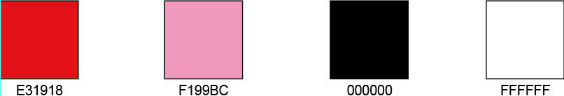
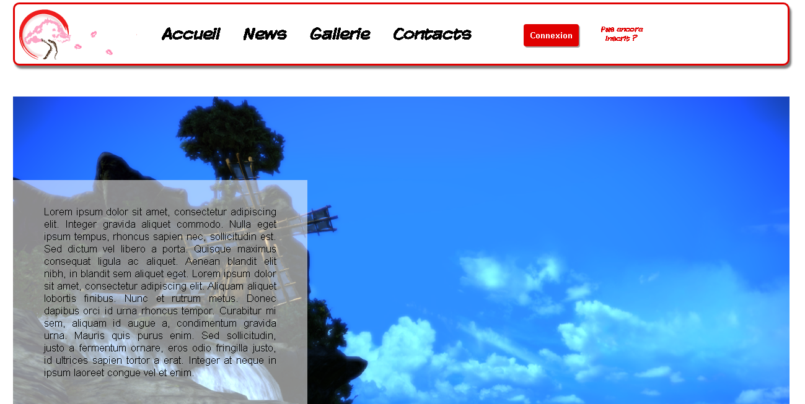

# npProject

Projet de site web porté sur le thème de l'actualité. Pour plus de précision, ce sera sur l'actualité manga en général.

------
Les principales couleurs utilisées sont celles ci :

Voici la page index : 
 
Et le logo qui est un sprite :

